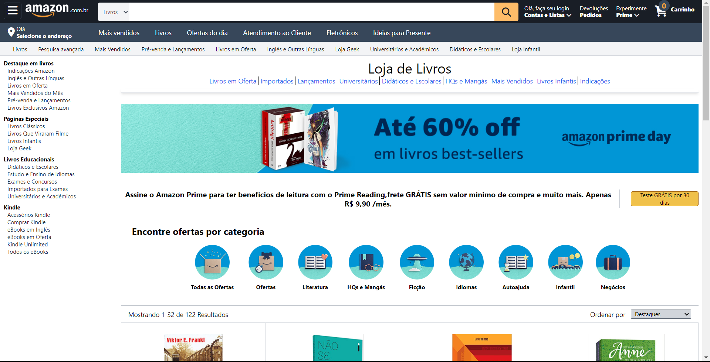

# Recriação do E-commerce Líder Mundial - Clone da Amazon

<div align="center">

</div>

## Descrição
Bem-vindo ao meu repositório do Clone da Amazon! Este projeto é uma ambiciosa recriação de um dos maiores e mais influentes e-commerces do mundo. Aqui, você encontrará uma replica detalhada da plataforma, projetada com dedicação e paixão para proporcionar uma experiência de usuário excepcional.

## Status do projeto
Projeto em andamento.

## Pré-requisitos

- HTML5;
- Tailwind CSS (v3.3.3 ou superior).

## Instalando

1. Clone o repositório para o seu ambiente local:

```
$ git clone https://github.com/igoraugustobrz/Amazon-clone
```

2. Navegue até o diretório do projeto.

```
$ cd Amazon Clone
```

## Contribuindo

Contribuições são bem-vindas! Se você quiser contribuir para o projeto, siga as etapas abaixo:

1. Fork o repositório e clone-o para o seu ambiente local.

2. Crie uma nova branch:

```
git checkout -b minha-contribuicao
```

3. Faça as alterações desejadas e commit-as:

```
git commit -m "Minha contribuição"
```

4. Envie suas alterações para o repositório remoto:

```
git push origin minha-contribuicao
```

5. Abra uma solicitação de pull no repositório original.

## Autor

- Igor Augusto
- E-mail: igoraugustobz@gmail.com
- Conecte-se comigo no [LinkedIn](https://www.linkedin.com/in/igorbrz/).